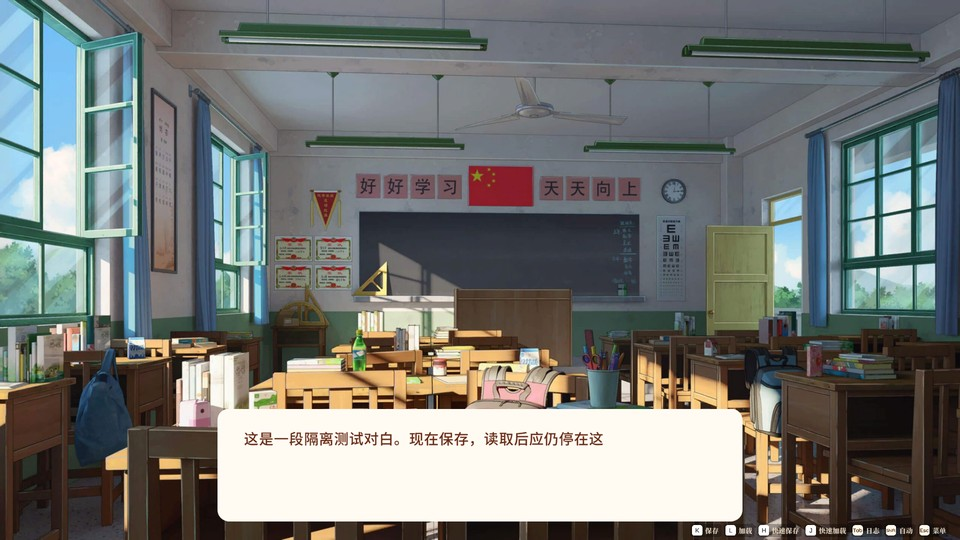
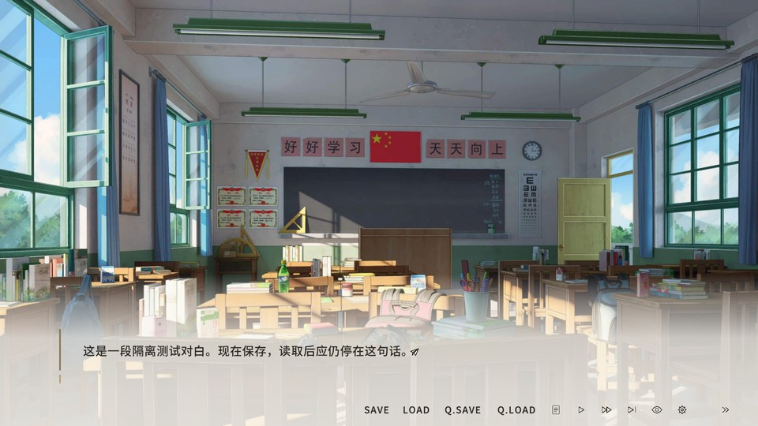

# 学生时代 · 对话存档与 ADV 界面

为《学生时代》提供对话中保存、读取、历史回看与可选 ADV 阅读界面的独立 **BepInEx 5** 插件。

> **开发预览版。** 当前代码可构建，已有独立测试和隔离游戏验证；尚未覆盖全部特殊演出、返回流程和跨设备云同步。上传源码不代表正式版发布。

## 功能

- **对话存档**：ADV四种配色、每页12槽与左侧详情，复制/交换/备注/删除、空槽保存/非空读取；Original模式保留原九格。当前重做待合批游戏验收。
- **两种阅读界面**：首次启动选择原版或 ADV，设置中随时切换。
- **ADV 操作**：逐字显示、自动、已读快进、剧情跳过、收起工具栏、隐藏界面。
- **全屏对话日志**：人物服饰预览、对白与选项分开记录、确认后跳转；新档携带已建立的完整回看记录。
- **独立存储**：原子写入、完整性校验、删除标记、跨设备分支识别；卸载插件保留存档。

| 原版模式 | ADV 模式 |
| --- | --- |
|  |  |

以上为模式选择页内嵌的实机预览；细节与最新构建可能不同。

## 开发接手入口

先读 [AGENTS.md](AGENTS.md)，再用 `python3 tools/knowledge.py "关键词"` 查 [精简项目知识库](docs/knowledge/README.md)。它只保存当前规则、源码和验证入口；历史细节按需查 STATUS。

## 快速开始

### 构建插件

准备 Python 3、.NET SDK 9 或更高版本，以及已安装 BepInEx 5 的本地游戏目录。游戏程序集和运行资源不包含在仓库中。

```sh
python3 tools/build.py --game "/path/to/StudentAge"
```

也可设置 `STUDENTAGE_GAME_DIR`，然后运行 `python3 tools/build.py`。Windows 可将 `python3` 换成 `python`。

输出目录：`dist/StudentAgeDialogueSave/BepInEx/plugins/StudentAgeDialogueSave/`。脚本只编译，不会自动修改游戏安装。安装、按键和存档路径见 [使用说明](docs/USER_GUIDE.md)。

### 运行独立测试

安装 .NET 9 SDK 和 Python 3，然后运行：

```sh
python3 tools/check.py
```

此命令运行存储、配置比较和历史数据编码测试，**不需要游戏，不会启动游戏**。GitHub Actions 执行相同检查。真实游戏测试需单独建立隔离环境，见 [开发与验证](docs/DEVELOPMENT.md)。

### 打包 Steam 模组（不发布）

```sh
python3 tools/package_workshop.py
```

先构建插件，再生成 `dist/workshop/` 下的原生 `plugins/` 模组目录、ZIP 与 SHA-256。安装规则和验证边界见 [Steam 测试包说明](docs/WORKSHOP.md)。

## 仓库结构

```text
src/                 插件源码：游戏适配、存储、UI 与生命周期
assets/ui-previews/  模式选择页的两张内嵌预览
tests/              独立测试、反射契约检查、隔离游戏测试驱动
tools/              构建、统一检查和隔离环境工具
docs/               使用、开发、当前状态与历史审查记录
.github/            自动检查与问题反馈模板
```

`qa/`、`dist/`、研究材料、日志、存档、游戏副本及编译缓存仅留本地，不提交。详细目录约定见 [仓库布局](docs/REPOSITORY_LAYOUT.md)。

## 当前边界

旧档只有文字、没有完整状态的历史无法补造跳转位置；部分特殊 CG、漫画、小游戏关联与原生返回流程尚未适配。当前回看仍有逐句捕获成本，不能称与原版性能完全相同。Steam 云存档仅确认本机路径条件，尚无两设备完整验收。

- [当前实现与验证证据](docs/STATUS.md)
- [使用说明与快捷键](docs/USER_GUIDE.md)
- [开发与验证](docs/DEVELOPMENT.md)
- [协作约定](AGENTS.md)

游戏、Unity、BepInEx 等运行依赖由使用者自行提供。预览中的游戏画面归原权利人所有，不能视为可另行使用的美术素材。
